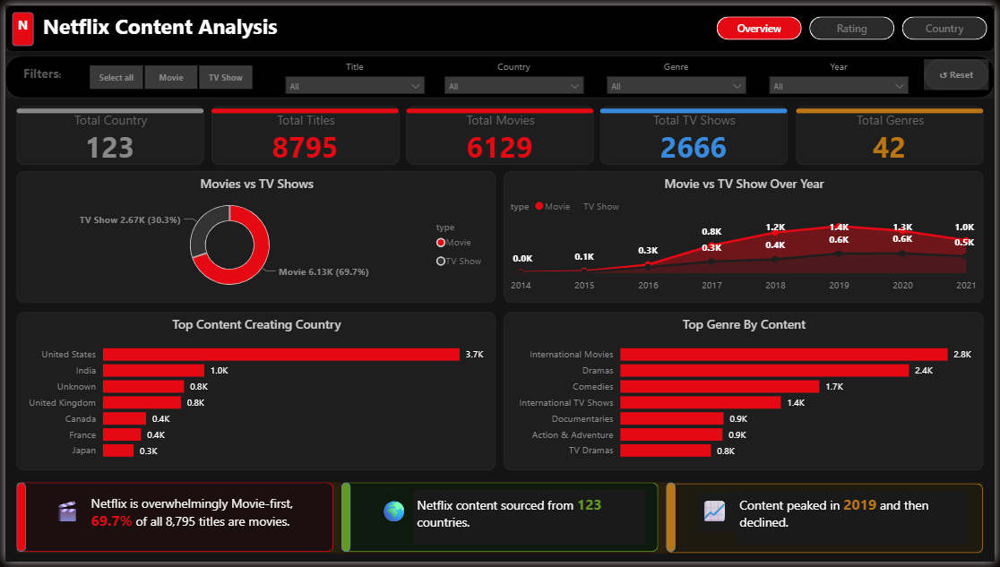
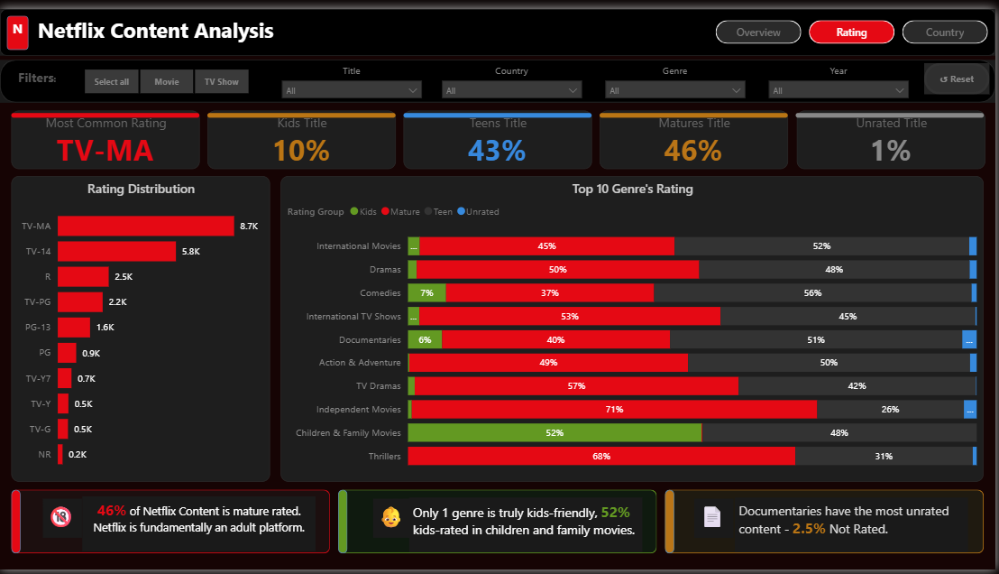
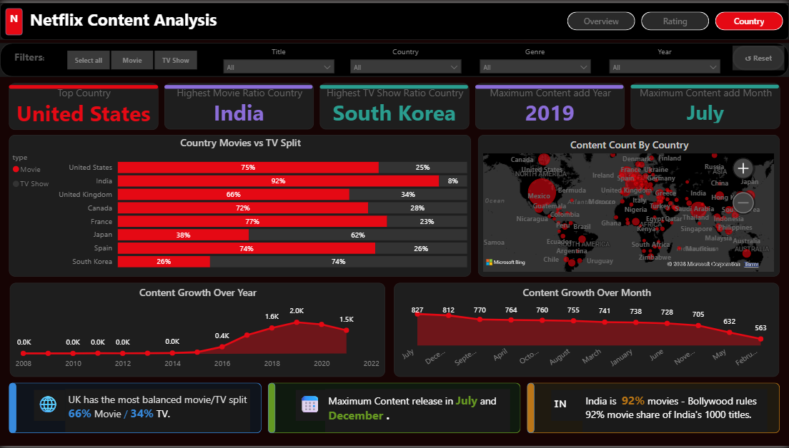

📊 Netflix Content Analysis Dashboard
🔍 Overview

This project analyzes Netflix’s content library to uncover trends in content growth, genre popularity, ratings, and global distribution.  
The goal is to transform raw data into meaningful insights using Python (EDA) and Power BI (Dashboard).

🎯 Objectives:
- Understand content distribution (Movies vs TV Shows)  
- Identify top genres and ratings  
- Analyze content growth over time  
- Explore country-wise content contribution  
- Generate insights from data  

🛠️ Tools & Technologies:
- Python (Pandas, Matplotlib, Seaborn)  
- Power BI  
- Jupyter Notebook  

🧹 Data Cleaning (Python):
- Handled missing values  
- Split multi-value columns (Genre, Country)  

📊 Exploratory Data Analysis (EDA):
- Content distribution by type  
- Top genres and ratings  
- Year-wise and month-wise content growth  
- Country-wise analysis  

📈 Dashboard Features (Power BI):

🔹 Page 1: Overview 
- Total Titles, Movies, TV Shows , Genres , Country  
- Content Growth Trend  
- Type Distribution 

🔹 Page 2: Rating 
- Genre Distribution  
- Rating Distribution 

🔹 Page 3: Country
- Country-wise Contribution  
- Content Growth over Year  
- Content Growth over Month

💡 Key Insights
- 69.7% content on Netflix is Movies and 30.3% content is TV shows.  
- Netflix content sourced from 123 countries.  
- Netflix content peaked in 2019 and then declined.  
- International Movie is the top 1 genre with 2800 titles.  
- TV-MA is the most common rating.  
- 46% Netflix content is mature-rated, Netflix is fundamentally an adult platform.  
- Maximum content produced from United States.  
- UK has most balanced Movie/TV split 66% movies and 34% tv shows.  
- India is 92% movies- Bollywood rules the 92% movie share of india's 1000 titles.  
- Maximum content release in july, july is the best month to content release.  

📸 Dashboard Preview

### Overview

### Rating

###3 country.png

This project demonstrates how data analysis and visualization can provide meaningful insights into content strategy and user targeting.
